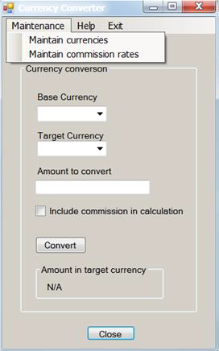
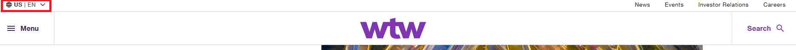

# SDET Technical Test - Web Applications

## Purpose

As part of our hiring process for technical roles we require all candidates to complete a small technical exercise. This is an important part of our process to allow us to assess an individuals technical ability when completing an exercise in their own time.

Given the importance of this exercise to our hiring process, we highly recommend you give this adequate consideration and address this task as you would do any other professional assignment in your current/previous workplace.

## Instructions

- There are two parts to this technical assessment
  - A written assessment of your ability to tackle a typical testing problem you might face as a test analyst
  - A code based assessment, testing your ability to automate a test scenario
- Written answers for part 1 should be submitted in a suitable format - e.g. a word document or markdown file placed into the root of this repository would be sufficient
- Please work on a new branch within this repository and when you are happy to submit, create a pull request back into the main branch
- Please use the pull request to comment on any aspects of your solution that you didn't have time to complete, are not complete to your satisfaction or are not working
- Please add a markdown file with instructions on how to setup and run your solution to question 2

**Please note that your submission must only contain your own work. Under no circumstances should your submission contain any content owned or created (in whole or in part) by a third party except where you are expressly permitted to do so by the relevant third party, for example an open-source library creators. Content must not be submitted which has been created (in whole or in part) through the use of generative AI technologies.**

## Question 1

### Introduction

The following is the main form of an application that converts values from one currency to another. The application has the following characteristics:

- The collection of currencies, exchange rates, and rules for applying commission are held in a shared database, accessed by multiple users of this application on a network.
- The user of this form selects a base currency, a target currency, specifies an amount (expressed in the base currency), can choose to include or exclude commission, then hits the Convert button to generate the equivalent value in the target currency. That value is shown where “N/A” is displayed in the screenshot below.
- The separate “Maintain currencies” form (not shown) provides operations for adding, deleting and editing currencies.
- A separate process constantly updates the database with exchange rates for any recognised currencies (you do not need to worry about how this works, but you do have control over stopping and starting it).
- The separate “Maintain commission rates” form (not shown) provides operations for specifying a minimum commission value and a collection of commission rates for different ranges of values. The minimum commission value and ranges are defined in Sterling. For example, for “amount to convert” values in the range 0.01 to 100.00 pounds Sterling, the commission rate is 5%. An example minimum commission value is £10.

Given the information provided, please answer the following questions:

1. Using the database and the GUI, how would you test the functionality of this form?
2. What tests would you perform to test the operations supported by the “Maintain currencies” form?
3. What tests would you perform to test the operations supported by the “Maintain commission rates” form?
4. What tests would you perform on the form above in order to test accessibility?
5. If you were automating the testing of this form for regression test purposes, what would you hope the developer had done that would make the automation easier?
6. If this application were used internationally, what further tests would you perform?
7. Looking at the screenshot of the form above, what user interface issues are immediately apparent (you may have mentioned some of these in previous answers)?

### Notes

- In answering the questions, identifying tests is sufficient
- Details of test data and expected results are not required where they can be inferred
- Aim for an answer no longer than 1200 words for this entire section
 
## Question 2

### Introduction

For this question, you can use any JavaScript or C# framework of your choice. We want you to automate the scenarios below using Chrome browser.

### Test Scenario

1. Open the following URL: https://www.wtwco.com/ICT
2. Change the language and region from top left corner to United States English, see example snippet.

3. Search for the word “IFRS 17” using the search box
4. Validate if you have arrived on the result page
5. Check if the result is sorted by “Date”. If not, sort by “Date”
6. Use the “Filter by” functionality and set Content Type to “Article”
7. Validate that each article in the list displays a link that starts with “https://www.wtwco.com/en-US/”

### Evaluation

Evaluation will be done on the following criteria:

- Clean and tidiness of the solution
- Design and architecture
- Readability
- Maintainability
- Stability of the tests
- Clarity of setup and execution documentation

Please provide instructions for setting up an environment from scratch and how to run the tests.

## Copyright
© 2023 Willis Towers Watson. All rights reserved. Proprietary and Confidential. For Willis Towers Watson employees and candidates only.
